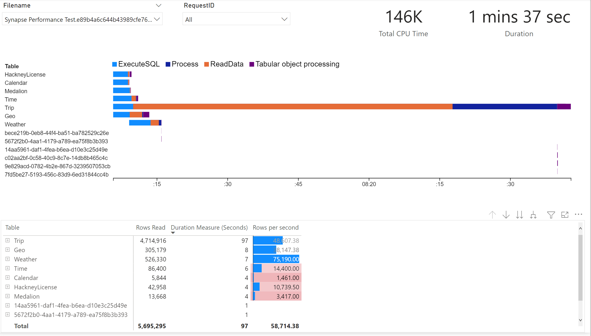
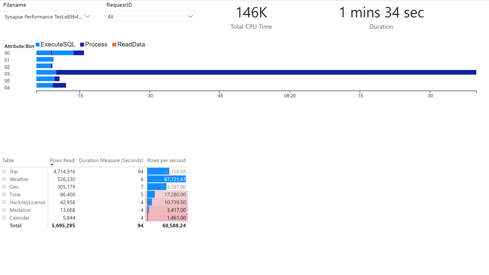

# Intro

[PBITracer.exe](./dist/PBITracer.exe) is a cmdline tool for a quick trace of Power BI Datasets using the XMLA Endpoint.


# How to start a trace?

```Shell
PBITracer.exe -s "XMLA Endpoint" -d "Dataset Name" -u "Username or Service Principal Id (app:id@tenantid)" -p "Password or Service Principal Secret" --events [Events to trace]
```

Example of trace to monitor queries:

```Shell
PBITracer.exe -s "powerbi://api.powerbi.com/v1.0/myorg/WorkspaceToTrace" -d "Dataset1" --events QueryEnd
```

Example of trace to profile a Dataset Refresh

```Shell
PBITracer.exe -s "powerbi://api.powerbi.com/v1.0/myorg/WorkspaceToTrace" -d "Dataset1" --events ProgressReportEnd JobGraph Error ProgressReportError ProgressReportCurrent
```


## Output

All the traces are saved as JSON files in the output path (configurable using the -ouput parameter):


## Authentication

If you execute PBITracer.exe without username (-u) and password (-p) a popup authentication will appear:


For non-interactive scenarios you can use a Service Principal, the parameters should have the following notation:

```Shell
-u app:[Service Principal Id]@[Tenant Id]
-p [Service Principal Secret]
```

Ensure the service principal is authorized on the following [Power BI Tenant Settings](https://docs.microsoft.com/en-us/power-bi/guidance/admin-tenant-settings):

- Allow service principals to user Power BI APIs
- Allow XMLA endpoints and Analyze in Excel with on-premises datasets

## Parameters


# Sample Power BI Templates

## PBI Dataset Refresh Analysis

This template is an adaptation from [Phil Seamark PBIX](https://dax.tips/2021/02/15/visualise-your-power-bi-refresh/) solution.

Download the [PBI Dataset Refresh Analysis.pbit](./pbit/PBI%20Dataset%20Refresh%20Analysis.pbit) template and setup the location parameter to the output folder of PBITracer.exe and you should be able to analyze your dataset refresh operations:





